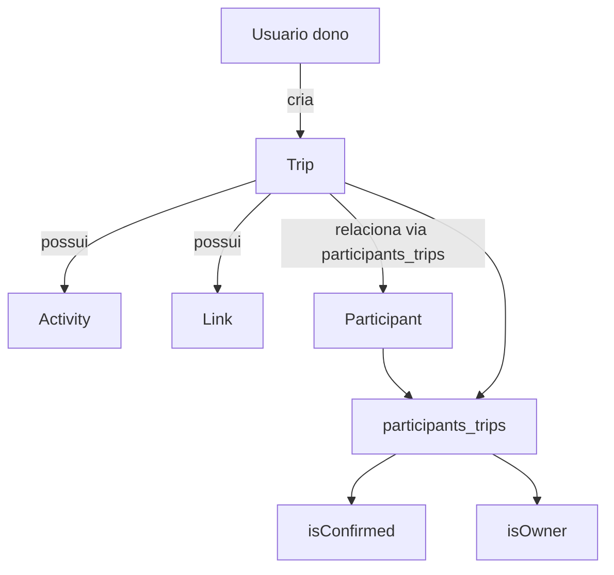
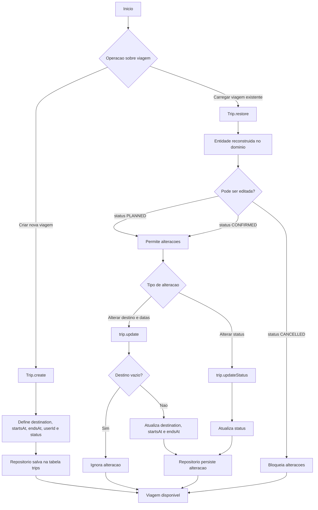
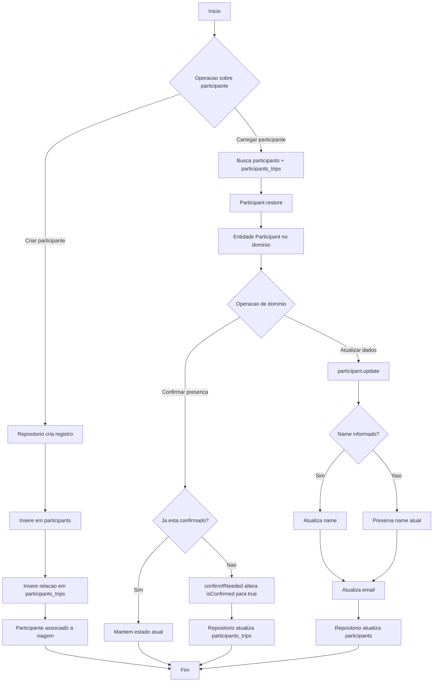
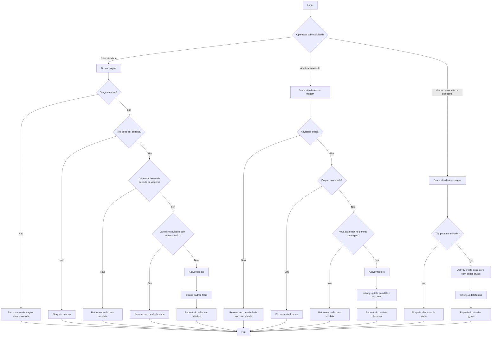
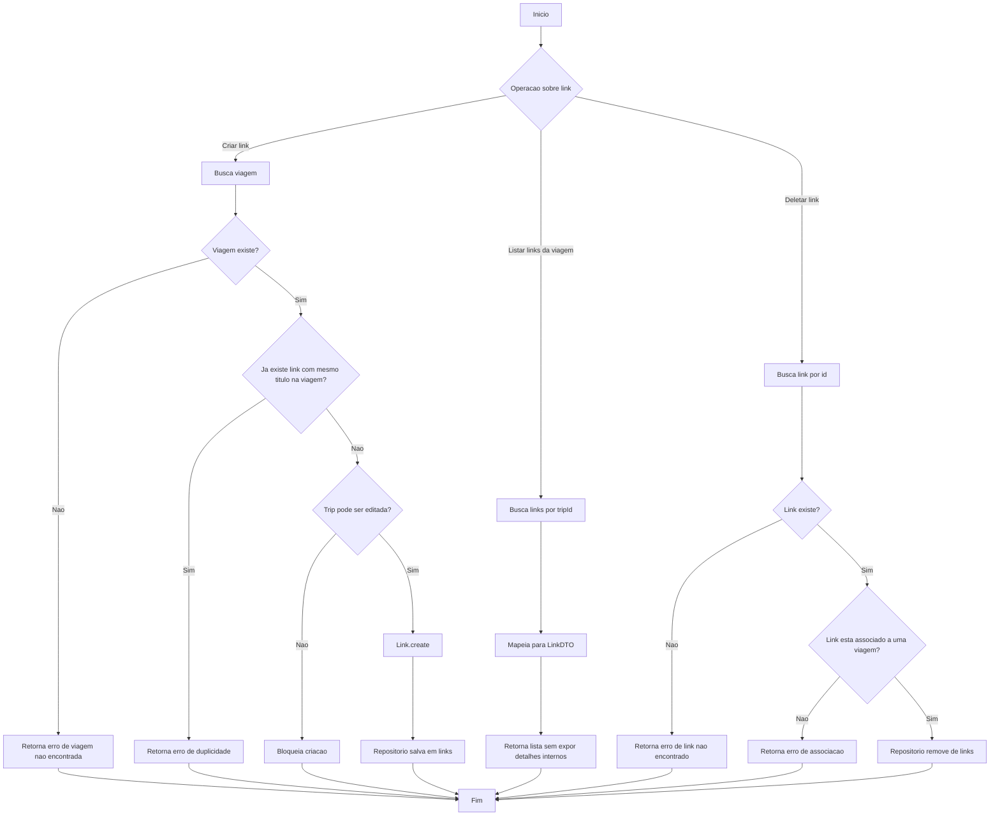
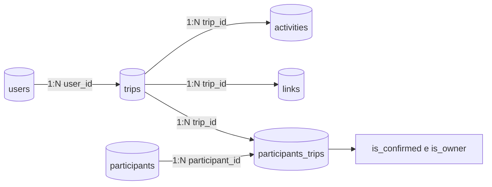

# Fluxogramas das Entidades

Este arquivo reune fluxogramas em Mermaid para visualizar o comportamento principal das entidades do backend.

## Visao geral do dominio

## Fluxo da entidade Trip

## Fluxo da entidade Participant

## Fluxo da entidade Activity

## Fluxo da entidade Link

## Relacionamento entre tabelas

